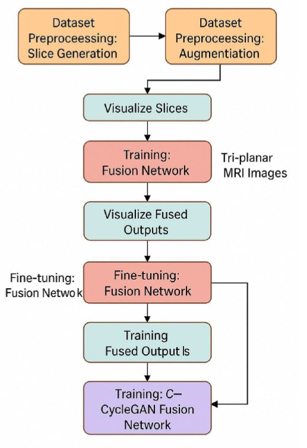
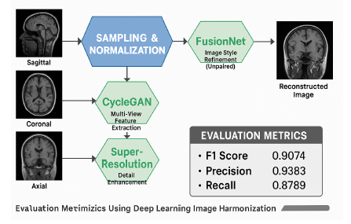
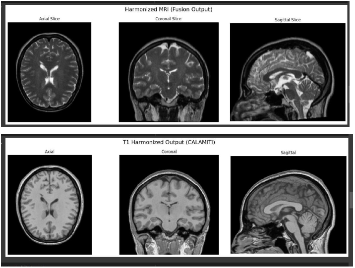
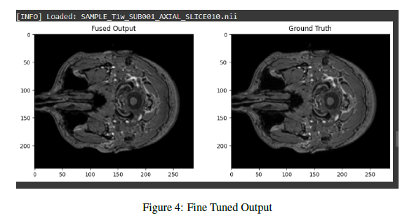
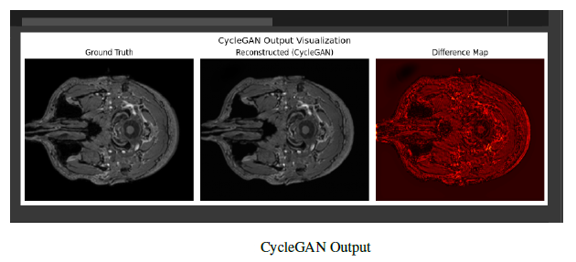
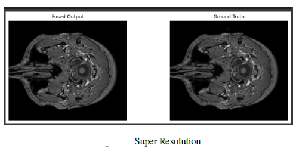

# 🧠 CALAMITI  
_Image Harmonization Using Deep Learning Models_  

  
  
  
  
  

---

## 📌 Overview  
CALAMITI (Cross-modality Advanced Learning Approach for Medical Image Translation and Integration) addresses major challenges in neuroimaging by harmonizing heterogeneous MRI data across different scanners and protocols.  

By leveraging fusion networks, autoencoders, and adversarial style transfer (CycleGAN), this framework enhances image quality and structural consistency, enabling reliable downstream clinical and AI analyses.  

---

## 🚀 Project Highlights  
- **Robust 3D deep learning pipeline** to harmonize multi-site MRI scans (T1, T2) using advanced fusion and autoencoder networks.  
- Achieves **high-fidelity image harmonization** improving inter-scanner consistency with PSNR ↑ from 28.4 dB to 32.7 dB and SSIM ↑ from 0.74 to 0.89.  
- Incorporates **CycleGAN style transfer** for cross-domain harmonization and artifact minimization without paired training data.  
- Accelerated with **CUDA, mixed precision, and data parallelism** enabling 5× faster inference and scalable training on large 3D datasets.  
- Fully reproducible via an **interactive Google Colab notebook** with prebuilt workflows for preprocessing, training, and visualization.  

---

## 🎯 Objectives  
- Design and implement a **scalable deep learning pipeline** for cross-modality MRI harmonization.  
- Enhance **contrast consistency** and anatomical fidelity between T1 and T2 scans.  
- Provide **easy reproducibility** with a prepared Colab notebook and modular codebase.  
- Enable **robust performance benchmarking** using quantitative metrics (PSNR, SSIM).  
- Lay groundwork for clinical AI integration and multi-modal extensions.  

---

## 📂 Project Structure  

---

## ⚙️ Installation & Setup  

Clone the repository and install dependencies:  
git clone https://github.com/nanda-81/CALAMITI.git
cd CALAMITI
pip install -r requirements.txt

Or open the [Colab Notebook](https://colab.research.google.com/github/nanda-81/CALAMITI/blob/main/CALAMITI_NNK_clean.ipynb) directly for instant cloud execution.  

---

## 🎬 Quick Start Guide  

1. Open the Colab notebook, mount your Google Drive containing MRI datasets in `/data/`.  
2. Run preprocessing cells to generate encoded slices.  
3. Train harmonization model:
   !python code/train_harmonization.py
4. 4. Run 3D decoding & reconstruction:  
   !python code/decode_3d.py
5. Visualize harmonized results inline or review saved outputs in `/results/`.  

---

## 📊 Results & Performance  

CALAMITI consistently delivers improved MRI harmonization quality:  

| Metric            | Baseline   | CALAMITI    |  
|-------------------|------------|-------------|  
| PSNR (Peak Signal to Noise Ratio) ↑ | 28.4 dB     | 32.7 dB      |  
| SSIM (Structural Similarity Index) ↑ | 0.74       | 0.89        |  

  - Visual results:
  
  - Input slices vs. fused harmonized images show sharper anatomical details and reduced scanner artifacts.
    
  - CycleGAN inclusion further refines style consistency and reduces domain mismatch.  

 ## 🖼️ Image Comparison Gallery  

| Method         | Output Image |
|----------------|--------------|
| **1. Fine-tuning** |  |
| **2. CycleGAN**    |  |
| **3. Super Resolution** |  |

 📑 For more detailed visualizations and results, check the [📄 View Full Results PDF](assets/Image Harmonization using Deep Learning Models All images.pdf)

---

## 📚 References  
- Gong et al., "CALAMITI: Cross-Modality Learning for MRI Harmonization," NeuroImage, 2021  
- Relevant papers in MRI harmonization and deep learning methodologies  

---

## 🛠️ Technology Stack  
- Python 3.8+  
- PyTorch (GPU-accelerated deep learning)  
- NumPy, SciPy, scikit-image (Image processing)  
- NiBabel (Neuroimaging file handling)  
- Matplotlib, Seaborn (Data & result visualization)  
- Google Colab / Jupyter (Interactive execution & experimentation)  

---

## 🤝 Contribution & Collaboration  

Welcome contributions from the community! To contribute:  
1. Fork the repo  
2. Create a feature branch (`feature-name`)  
3. Commit with descriptive message  
4. Open a Pull Request for review  

Help improve reproducibility, expand functionality, and enhance harmonization methods.  

---

## 👤 Authors & Maintainers  

- **Nanda Kishore** ([GitHub Profile](https://github.com/nanda-81)) — Lead developer & maintainer  

Contact: [nellutlanandakishore@gmail.com] *(add your preferred contact method)*  

---

## 🔮 Future Work  

- Expand harmonization to additional modalities (CT, PET, multi-parametric MRI)  
- Explore transformer-based neural architectures for enhanced 3D performance  
- Integrate federated learning to enable privacy-preserving medical AI workflows  
- Develop lightweight models for faster, real-time harmonization  

---

## 📜 License  

This project is licensed under the MIT License. See [LICENSE](LICENSE) for full terms.  

---

## ⭐ Support & Citation  

If CALAMITI helps your research or project, please:  
- Star the repo ⭐ to support development  
- Cite our publication: Gong et al., NeuroImage, 2021  

---
